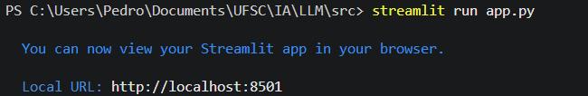
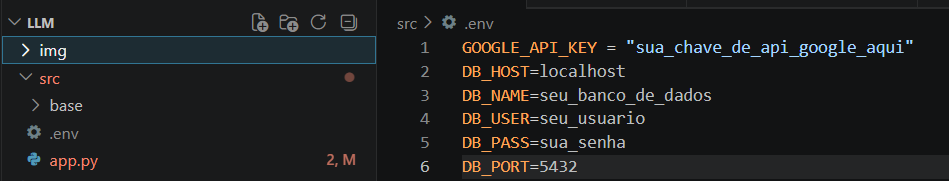

### 📝 Descrição do Projeto
<p align="justify">&emsp;&emsp;O <b>Guia de Saúde</b> é uma aplicação web interativa desenvolvida para atuar como um assistente virtual focado em pré-triagem e orientação de sintomas. Ao interagir com o utilizador, a Inteligência Artificial recolhe informações sobre o quadro clínico, formula hipóteses (sem fornecer diagnósticos definitivos) e encaminha para a especialidade médica mais adequada.</p>

---

### 🛠️ Tecnologias Utilizadas

 - **Python (3.13.12)**: Linguagem de programação base.

 - **Streamlit (1.56.0)**: Framework utilizado para a criação da interface gráfica e gerenciamento do estado da sessão do chat.

 - **Google GenAI SDK (1.70.0)**: Biblioteca oficial para integração com os modelos Gemini da Google.

 - **Modelo Gemma-4-31b-it**: O motor de IA utilizado para processar as mensagens.

 - **Python-dotenv (1.2.2)**: Para o gerenciamento seguro de variáveis de ambiente (chaves de API).

--- 

### 🚀Instruções de execução

<p align = "justify">&emsp;&emsp;Para executar a aplicação, faz-se necessário instalar os seguintes pacotes: </p>
 
  - google-genai 
  - python-dotenv 
  - streamlit

```bash
pip install -U google-genai python-dotenv streamlit
```

<p align = "justify">&emsp;&emsp;Após a instalação das dependências, na pasta src,inicie a aplicação com o seguinte comando:</p>

```bash
streamlit run app.py
```

<p align = "justify">&emsp;&emsp;Acesse o link gerado:</p>

<div align="center">
  <kbd>
    <br>
  </kbd>
</div>

---

### ⚠️ | Atenção 

<p align = "justify">&emsp;&emsp;A chave do agente utilizado não está presente no repositório, pois, ao envia-la para o GitHub, será derrubada pelo próprio Google. Sendo assim, cabe a você:</p>

  - Criar um arquivo .env na pasta src 
  - Utilizar a sua própria chave

 <div align="center">
  <kbd>
    <br>
    Arquivo .env na pasta indicada contendo a key adquirida
  </kbd>
</div>
   
---

### ❓ | Ajuda
Como obter chave gratuita: https://www.youtube.com/watch?v=Uyn-P2nRvDA&t=14s

### 🎥 | Aplicação em funcionamento

<div align="center">
  <kbd>
    <video src="vid/LLM.mp4" width="320" height="240" controls></video>
  </kbd>
</div>
